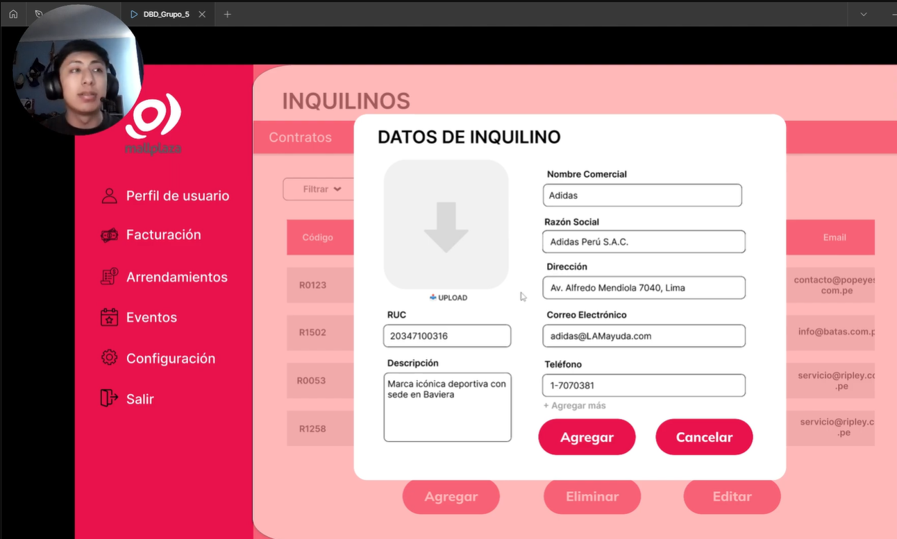
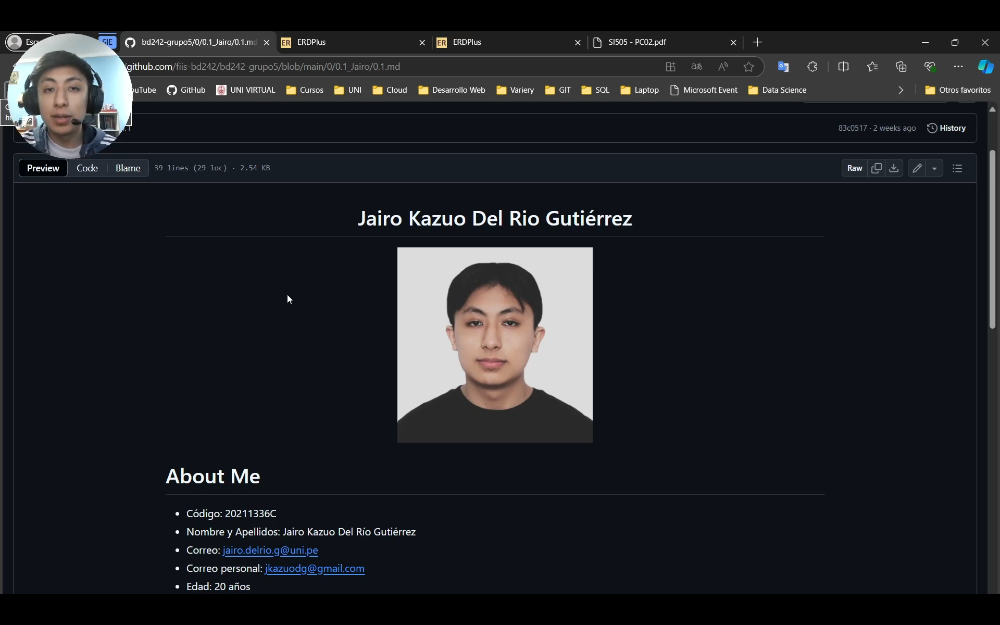

<h1 align="center">Jairo Kazuo Del Rio Gutiérrez</h1>

  

# About Me
- Código: 20211336C
- Nombre y Apellidos: Jairo Kazuo Del Río Gutiérrez
- Correo: jairo.delrio.g@uni.pe
- Correo personal: jkazuodg@gmail.com
- Edad: 20 años

# Presentación

- ¿Por qué la UNI - FIIS?
  Desde chico me ha gustado las matemáticas, luego en la secundaria me enteré que había una universidad que solo entraban los mejores en el área que andaba interesado; las ciencias y matemáticas. No fue hasta en pandemia que me decidí que la FIIS era la facultad a la que quería entrar.

- ¿Cómo evalúo mi experiencia con lo cursos de la carrera hasta el momento?
  Considero que muchos de los cursos que he llevado me han ayudado bastante en la parte de programación, pero otros también para entender mejor la parte administrativa, financiera y sistemática de como se debe manejar una organización o empresa. Sin embargo, a opinión propia existen algunos cursos más relacionados al "Soft System" que deberían considerarse para posgrado ya que abarca mayormente investigación.

- ¿Cuál es mi experiencia en programación y base de datos?
  Básica, tengo conocimientos intermedios de SQL; sin embargo para el manejo de base de datos considero que puedo mejorar mucho más. En programación tengo conocimientos en C++, Python y JS.

- ¿Cómo fue mi experiencia en el curso de Modelado Conceptural de datos y qué tema elegí?
  El tema que realicé fue sobre una empresa que fabricaba plásticos que eran destinados para empresas que lo usaban para sus productos como panetones, papel higénicos o bolsas personalizadas; por ejemplo.

- ¿Qué espero del curso?
  Espero poder aprender mucho más sobre Desarrollo Web, consideró que no lo pudo concretar en el curso de POO, y conocer más sobre como diseñar correctamente una Base de Datos. Igualmente familiarizarme más con Git y trabajo en equipo.

- ¿Cómo me veo en 10 años?
  Me veo contruyendo y dirigiendo mi propia empresa tecnológica la cual pude haber iniciado con la experiencia que estoy contruyendo desde ahora, también espero haber conocido buenos compañer@s con los que pueda compartir mi tiempo fuera y dentro del trabajo.

## PRESENTACIÓN PCs
### Presentación PC1
Módulo 4: Inquilinos
Link del video individual: https://www.youtube.com/watch?v=Rs0_Pm492nE

  

### Presentación PC2
Link del video individual: https://youtu.be/SXLXpZgMsfM

  

