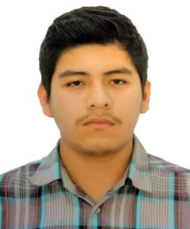

# 0.4. Gavino Geldres

- Código: 20211242I
- Nombre y Apellidos: Gavino Gabriel Geldres Pinto
- Correo UNI: gavino.geldres.p@uni.pe
- Correo personal: gavinogeldresp@gmail.com
- Edad: 21 años

#Presentación
- ¿Por qué la UNI - FIIS?
	.
- ¿Cómo evalúo mi experiencia con lo cursos de la carrera hasta el momento?

- ¿Cuál es mi experiencia en programación y base de datos?

- ¿Cómo fue mi experiencia en el curso de Modelado Conceptural de datos y qué tema elegí?

- ¿Qué espero del curso?

- ¿Cómo me veo en 10 años?