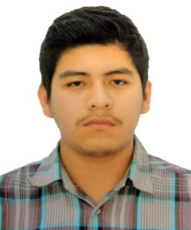

# 0.4. Gavino Geldres

- Código: 20211242I
- Nombre y Apellidos: Gavino Gabriel Geldres Pinto
- Correo UNI: gavino.geldres.p@uni.pe
- Correo personal: gavinogeldresp@gmail.com
- Edad: 21 años

#Presentación
- ¿Por qué la UNI - FIIS?
	Porque desde niño tenia un gran deseo de estudiar una inegniería y cuando supe de la UNI decidi plantarmelo como objetivo, y decidi la FIIS porque me llamaba mucho la atención la carrera de Ingeniería de Sistemas por su complejidad.

- ¿Cómo evalúo mi experiencia con lo cursos de la carrera hasta el momento?
	Siento que ha sido algo bastante chevere porque pude conocer más sobre la teoria de sistemas y en muchos casos su aplicaciones a un entorno empresarial.

- ¿Cuál es mi experiencia en programación y base de datos?
	En mi tiempo en la universidad he adquirido conocimientos de programción como python, c++ y java. Y en el curso de POO pude aprender nuevas tecnologías de desarrollo web y manejo de base de datos.

- ¿Cómo fue mi experiencia en el curso de Modelado Conceptural de datos y qué tema elegí?
	Fue algo nuevo y creo yo complementario a su curso prerequisito, porque se aprendió a organizar y estructurar los datos de una empresa en entidades para su posterior diseño de una base de datos. En este curso modelamos el área de producción de una empresa avícola.

- ¿Qué espero del curso?
	Espero poder reforzar mis conocimientos a la fecha y como estos pueden implementarse en el diseño de una base de datos.

- ¿Cómo me veo en 10 años?
	Espero estar trabajando en algo de lo que haya aprendido o desarrollado en mi trayectoria como estudiante y a la par seguir creciendo profesionalmente.

Videos:
- PC1: https://youtu.be/eEWZaiSicuA
