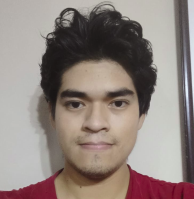

<h1 align="center">Emanuel Ruben Huamani Ruiz</h1>

  

# About Me
- Código: 20181195H
- Nombre y Apellidos: Emnuel Rubén Huamani Ruiz
- Correo: emanuel.huamani.r@uni.pe
- Correo personal: emanuelrubenhuamaniruiz@gmail.com
- Edad: 24 años

# Presentación

- ¿Por qué la UNI - FIIS?
  La idea de la UNI fue inculcada por mis padres desde que estaba en primaria. Mi padre estudió aquí, así que desde entonces me inculcaron la idea de terminar estudiando en esta universidad. Luego, ya en secundaria, noté mi habilidad en las matemáticas y decidí postular. Elegí FIIS porque me empezó a atraer el mundo de la informática, y en Ingeniería de Sistemas está presente esa rama.

- ¿Cómo evalúo mi experiencia con lo cursos de la carrera hasta el momento?
  Me gusta lo mucho que la universidad te aporta en base teórica. Disfruté mucho los cursos de algoritmia y programación orientada a objetos, los cuales fueron de los pocos que vería en Ingeniería de Sistemas.

- ¿Cuál es mi experiencia en programación y base de datos?
  Participo en el grupo de Programación Competitiva de la UNI, teniendo la oportunidad de representar a la universidad en algunas ocasiones. Además, actualmente me encuentro practicando como programador backend. En cuanto a bases de datos, tengo la experiencia del curso de modelado, principalmente.

- ¿Cómo fue mi experiencia en el curso de Modelado Conceptural de datos y qué tema elegí?
  Fue bastante buena. Aprendí muchos conceptos y trabajé en la parte logística de una empresa. Se nos complicó un poco la parte final, pero al final nos sirvió mucho.

- ¿Qué espero del curso?
  Espero poder aprender mucho más sobre desarrollo y dominar los conceptos de diseño de bases de datos que me sirvan en el mundo laboral. Además, quiero aprender y dominar más sobre el uso de Git y de los motores de bases de datos.

- ¿Cómo me veo en 10 años?
  Me veo ya teniendo una empresa propia o iniciando una empresa tecnológica, siendo un desarrollador experto y con una maestría.

  ## PRESETNACIÓN PC1
  Módulo 7: Eventos
  Link del video individual: https://youtu.be/_imLK59c02Y
