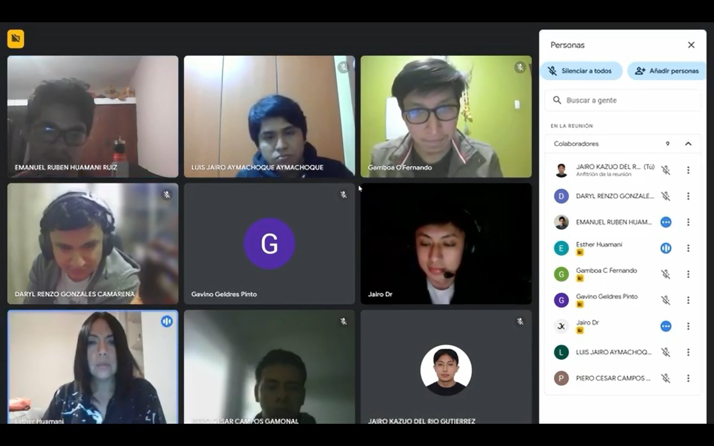

# 1. Descripción de la Empresa 
## MallPlaza

Mallplaza (escrito Mall Plaza hasta octubre de 2016) es una cadena de centros comerciales chilena que se encuentran distribuidos en nueve ciudades de Chile, en cuatro de Perú y cinco en Colombia.
De los 17 centros comerciales en Chile, ocho se encuentran en el Gran Santiago, dos en el Gran Concepción, y los otros en Arica, Iquique, Calama, Antofagasta, Copiapó, La Serena y Los Ángeles. En Perú, tiene centros comerciales en las ciudades de Lima, Arequipa, y Trujillo. Por su parte, en Colombia cuenta con complejos comerciales en Cali, Bogotá, Barranquilla, Cartagena y Manizales.

## Entrevista
Entrevista realizada a Esther Huamaní Torres actual Subgerente Regional de Análisis Financiero en MallPlaza

## CONTENIDO
[1.1. Datos de la empresa](1.1/1.1.md)

[1.2. Modelo de negocio](1.2/1.2.md)

[1.3. Procesos de Negocio identificados](1.3/1.3.md)

### Link

- [Entrevista1](https://www.youtube.com/watch?v=JYxE4OHUHl8)

- 
