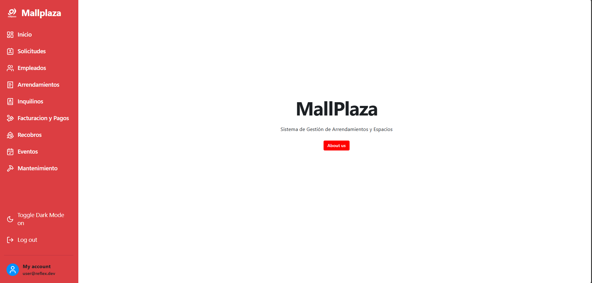
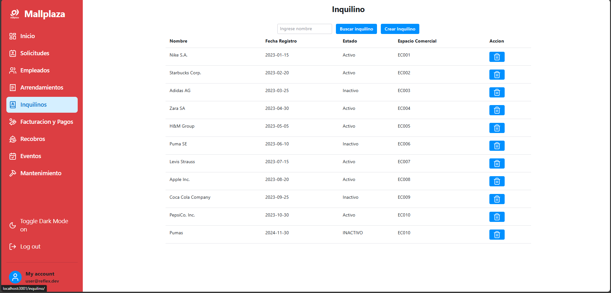
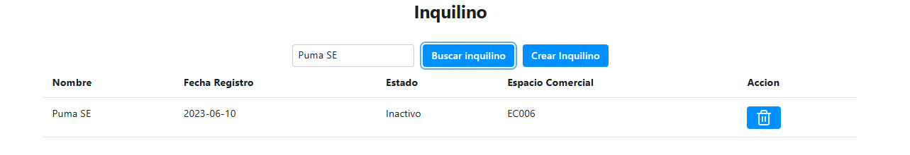
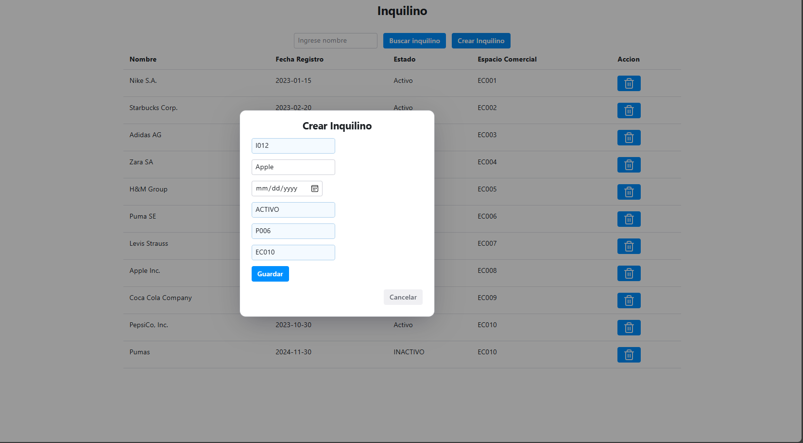
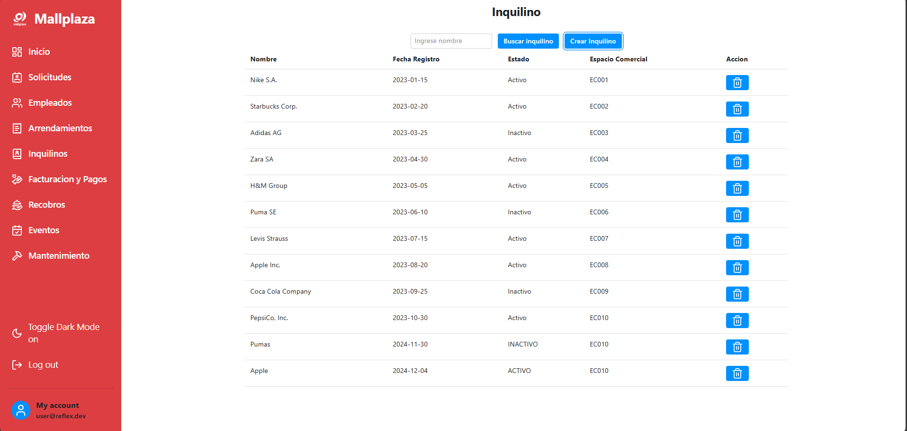
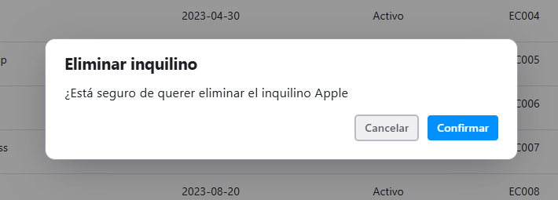
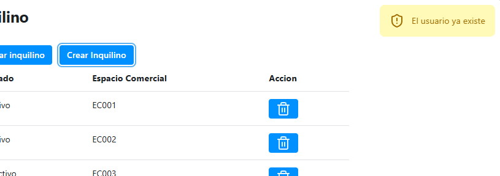

# 11.3. Flujo de Pantallas por Módulo

## MÓDULO 4: INQUILINOS
1. Como primera vista tenemos el ingreso a la plataforma de Mallplaza
   
   

2. Luego procedemos a ingresar a la sección del módulo de inquilinos, donde se mostrará la carga de los principales inquilino en MallPlaza

    

3. Posteriormente también podremos realizar búsquedas de los inquilinos por su nombre

    

4. Al darle al botón de crear inquilino, se abrirá esta ventana emergente, donde ingresaremos los datos del inquilino que querramos agregar a la base de datos

    

    

5. Si se desea eliminar un registro de un inquilino, se motrará esta ventana para realizar el delete del seleccionado.

    

6. Como último pantalla del flujo se tiene el caso en donde se realiza la creación de un inquilino que ya existe con el mismo nombre u otro registro como RUC

    