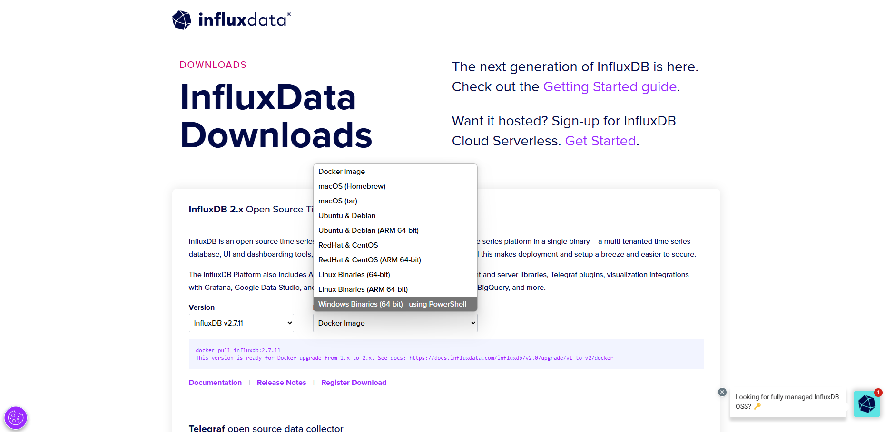
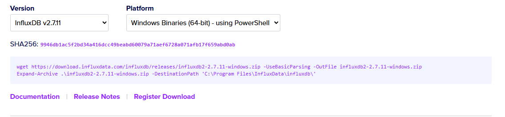
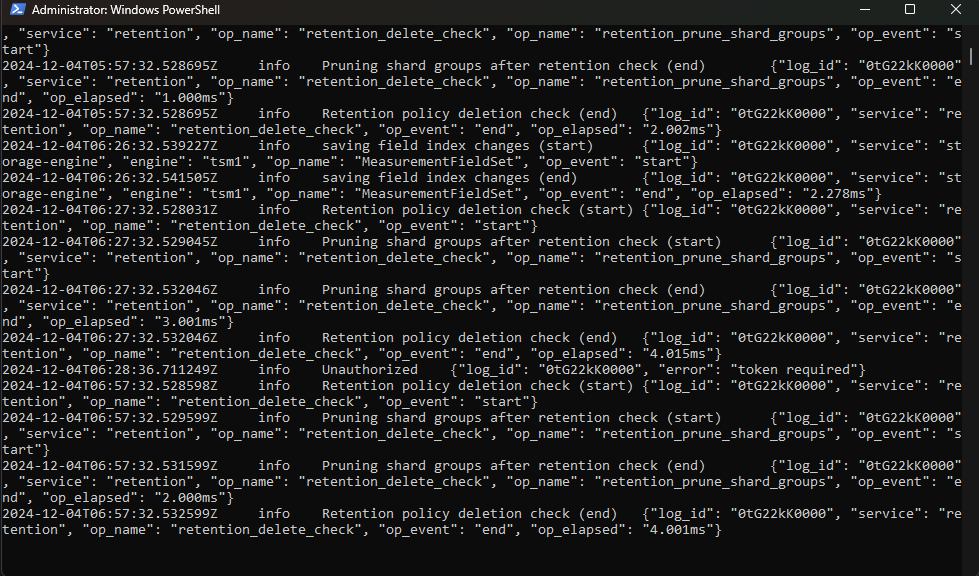
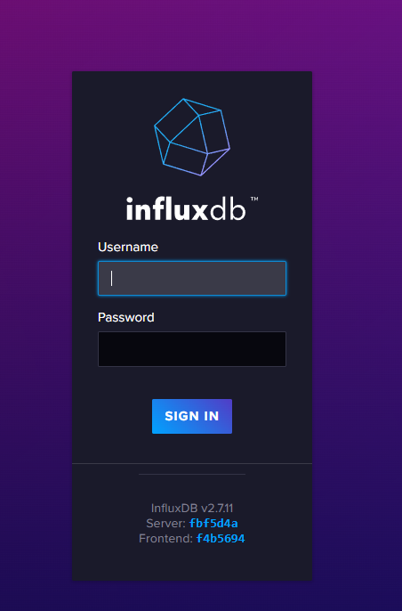
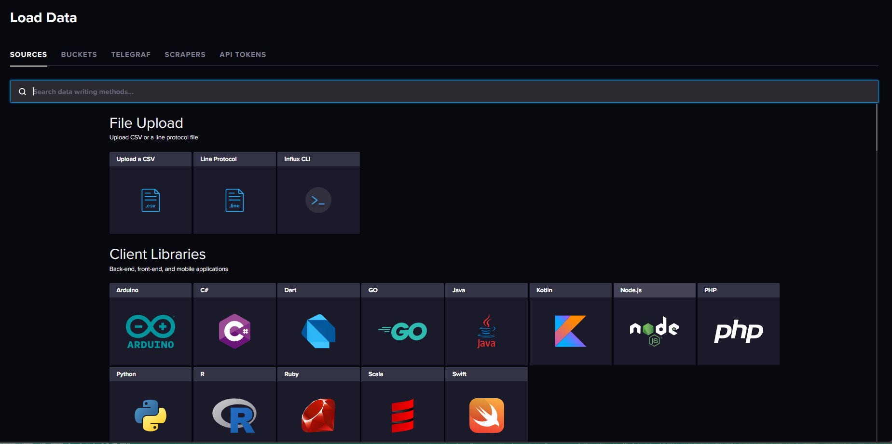

# 12.3. Configuración

En esta sección se mostrará los pasos a seguir para la instalación y uso de influxdb en Windowns. Por temas de comodidad usaremos la terminal de PowerShell

## 1. Descargar InfluxDB
1. Primero debemos dirigirnos a la página de influxdb downloads. Luego seleccionamos "Windows Binaries (64-bit)" en el menú desplegable que se muestra en la imagen
    
    

2. Seleccionar y copiar el URL de descarga proporcionada para la última versión disponible.
    
    

3. Abre PowerShell con permisos de administrador. Y pegamos el siguiente comando para la descarga del archivo:
   ```
    wget https://download.influxdata.com/influxdb/releases/influxdb2-2.7.11-windows.zip -UseBasicParsing -OutFile influxdb2-2.7.11-windows.zip
   ```

   ```
    Expand-Archive .\influxdb2-2.7.11-windows.zip -DestinationPath 'C:\Program Files\InfluxData\influxdb\'
   ```

4. Nos dirigimos al directorio, e iniciamos el servidor:
   ```
    cd 'C:\Program Files\InfluxData\influxdb\'
    .\influxd.exe
   ```

   

5. Luego verificamos que se ha hecho la correcta implementación, en nuestro navegador: http://localhost:8086

6. Iniciamos sesión. Cuando se ingresa por primera vez te pedirá ingresar un username, contraseña, organización y un initial bucket. Luego de eso podremos inicializar y se nos generará un token que tendremos que guardar.
   
   

7. Finalmente podremos hacer uso de influxdb desde esta interfaz
   
   