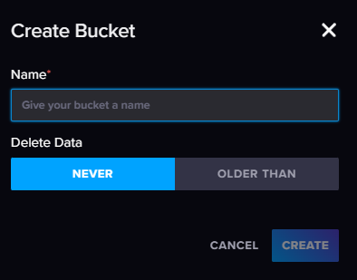
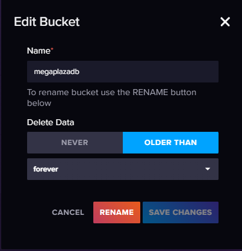
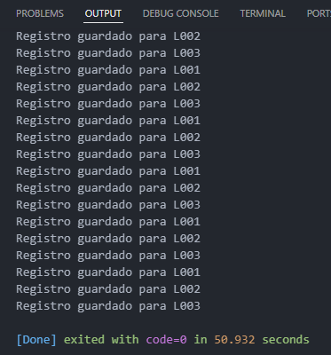
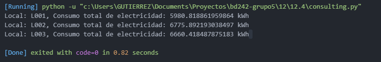
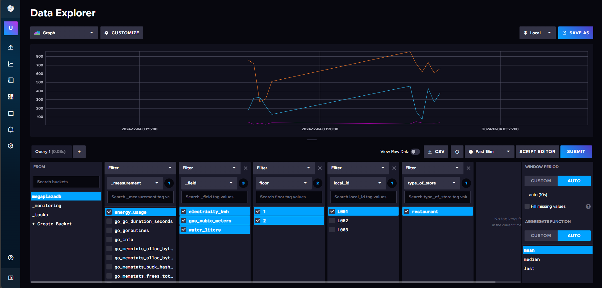

# 12.4. Implementación

Luego de haber realizado instalación, procedemos a crear los Buckets

1. Creamos el bucket
   
   

2. Una vez creada, tenemos la opciones de hacer ajustes al bucket
   
   

3. El siguiente paso, haremos la simulación de los datos correspondientes al uso o consumo de electricidad, agua o gas.
- Measurement (Medición): energy_usage
- Tags (Etiquetas):
   - local_id (identificador único del local).
   - floor (piso en el que se encuentra).
   - type_of_store (tipo de negocio, como "restaurante", "ropa", etc.).
- Fields (Campos):
  - electricity_kwh (consumo eléctrico en kWh).
  - water_liters (consumo de agua en litros).
  - gas_cubic_meters (consumo de gas en m³).

4. Se hará la escritura de los Datos en InfluxDB -> [Para ver más presiones acá](use_case.py)
    Lo que se realizó primero fue la configuración para inicializar el cliente de InfluxDB
    Luego se realizó la generación de los datos locales, por cada tipo de local, para finalmente generar los datos generedos y escribirlos en InfluxDB

5. También se puede usar Flux para analizar los datos. Aquí hay un ejemplo para consultar el consumo total de electricidad por local en la última hora [Ver más](consulting.py)
    
    

    

Finalmente luego de hacer dos sesiones de generación de datos en el consumo de enrgía, agua y luz de tres locales de Mallplaza, podremos visualizar en nuestro bucket la data almacenada:

En la imagen se puede observar el filtro que se realiza para visualizar los tres fields pero solo para el local con id_local L001 