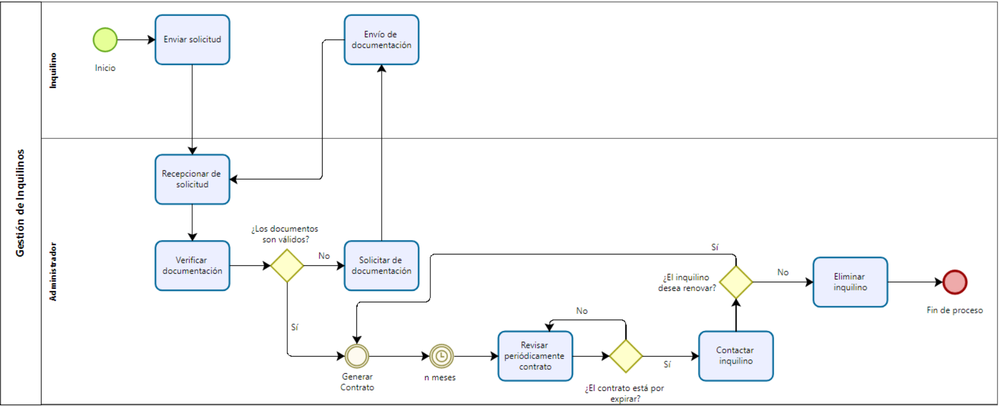

# 2.1. Procesos AS-IS

Acá mostratemos los procesos que hemos podido identificar de MallPlaza y como actualmente se manejan

## Proceso de login y seguridad

## Proceso de gestión de empleados

## Proceso de Inquilinos
Este flujo representa un proceso más de intervención humana y sistema desarticulados.

| Secuencia | Actividad | Descripción | Responsable |
| --------- | --------- | ----------- | ----------- |
| 1| Enviar Solicitud | Se envía la solicitud de arrendamiento a Mallplaza | Inquilino |
| 2 | Verificar documentación | Revisar manualmente la documentación recibida para asegurarse de que cumplen lo requisitos. | Administrador |
| 3 | Solicitar documentación | Solicita al inquilino que envíe la documentación necesario para veritifcar la valizar de la solicitud | Administrador | Administrador |
| 4 | Recepcionar solicitud | Recepción manual de la solicitud y el registro de la misma. | Administrador |
| 5 | Generar contrato | Evento intermedio que incluye la creación y generación de un nuevo contrato | Administrador |
| 6 | Revisar periódicamente contrato | Revisa periódicamente el contrato del inquilino para determinar cuáles están por vencerse | Administrador |
| 7 | Contactar inquilino | Se contacta al inquilino para discutir la renovación del contrato, se puede realizar menciante correo electrónico, llamada telefónica o cualquier medio manual | Administrador |
| 8 | Eliminar inquilino | Si el inquilino decide no renovar el contrato, el administrador elimina manualmente al inquilino de los registros del sistema | Administrador |

## Proceso de realización de Mantenimiento

Este flujo representa el proceso o la forma como se da actualmente el proceso de mantenimiento correctivo en las tiendas.

