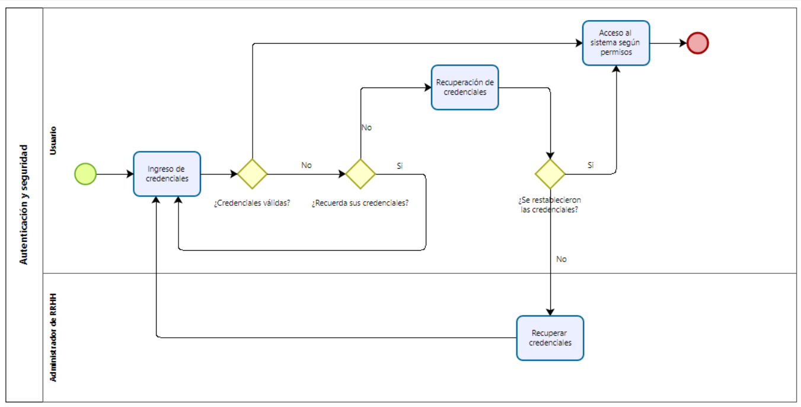
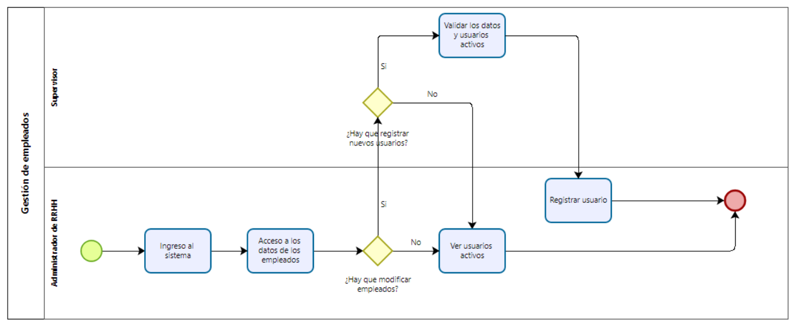
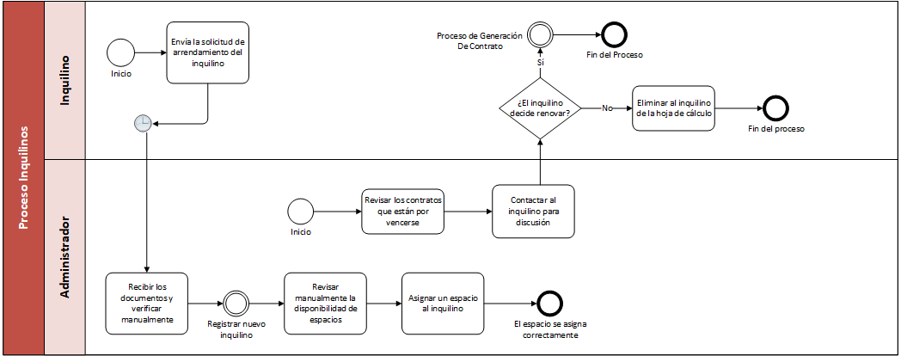
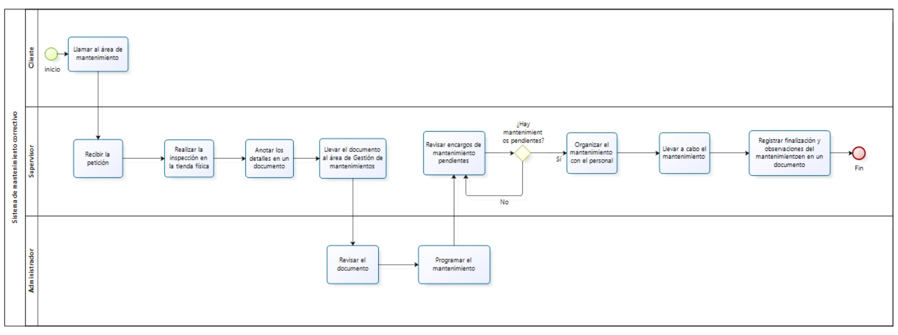

# 2.1. Procesos AS-IS

Acá mostratemos los procesos que hemos podido identificar de MallPlaza y como actualmente se manejan

## Proceso de login y seguridad

## Proceso de gestión de empleados

## Proceso de Inquilinos
Este flujo representa un proceso más de intervención humana y sistema desarticulados.

## Proceso de realización de Mantenimiento

Este flujo representa el proceso o la forma como se da actualmente el proceso de mantenimiento correctivo en las tiendas.

