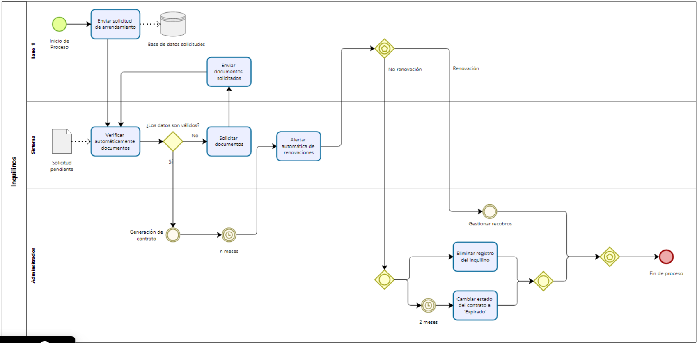
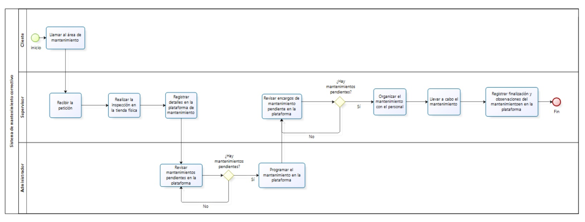

# 2.2. Procesos TO-BE

## Proceso Inquilinos
El proceso del módulo inquilinos abarca desde el registro hasta la gestión de solicitudes. Se muestra la interacción entre el inquilino, administrador y el sistema en un solo diagrama simplificado.

| Secuencia | Proceso | Descripción | Responsable |
|-----------|---------|-------------|-------------|
| 1 | Enviar solicitud de arrendamiento | El inquilino envía la solicitud de arrendamiento a través de un portal de línea | Inquilino |
| 2 | Verificar automáticamente documentos | El sistema verifica automáticamente los documentos del inquilino (documentos requeridos, antecedentes, etc) | Sistema |
| 3 | Solicitar documentos | El sistema solicita al usuario del faltante de docuemntos que se necesitan | Sistema |
| 4 | Enviar documentos solicitados | El usuario envía los documentos necesarios para seguir con el proceso de arrendamiento | Inquilino |
| 5 | Generación de contrato | Proceso intermedio donde el administrador y el inquilino realizan el acuerdo para el contrato | Administrador |
| 6 | Aletar para renovaciones | El sistema genera automáticamente alertar cuando los contratos estén por expirar | Sistema |
| 7 | Gestionar recobros | Proceso intermedio donde se gestioanr el recobros de servicios y pagos entre el inquilino y MallPlaza | Administrador |
| 8 | Eliminar registro del inquilino | Si el inquilino decide no renovar, se elimina automáticamente el registro del inquilino, se puede dar solo si este no tiene deudas pendientes o si la normativa lo permite | Administrador |
| 9 | Cambiar estado del contrato a "Expirado" | Se manteniene el registro para futuras referencias | Adminstrador |

## Proceso Mantenimiento 

El proceso del módulo de mantenimientos permite el registro de incidencias que surgen en las tiendas del centro comercial y también la programación de mantenimientos.

