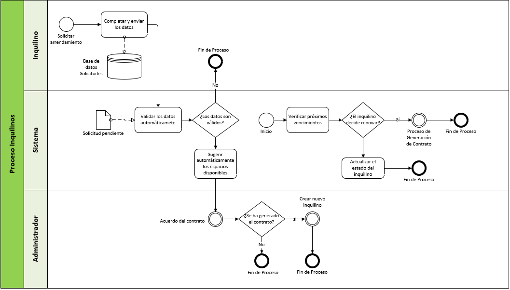

# 2.2. Procesos TO-BE

## Proceso Inquilinos
El proceso del módulo inquilinos abarca desde el registro hasta la gestión de solicitudes. Se muestra la interacción entre el inquilino, administrador y el sistema en un solo diagrama simplificado.

