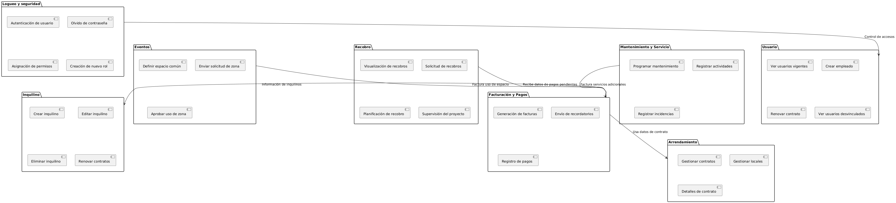

# 3.1. Diagrama de Paquetes

Cada paquete representa un módulo del sistema, con sus correspondientes subcomponentes o requerimientos clave.

## Gráfico

- Facturación y Pagos se conecta con Arrendamiento para obtener los detalles de los contratos.
- Facturación y Pagos se relaciona con Inquilino para acceder a la información de los inquilinos.
- Recobro recibe información de Facturación y Pagos sobre pagos pendientes o vencidos.
- Eventos y Facturación y Pagos están conectados para gestionar la facturación de espacios comunes.
- Mantenimiento y Servicio interactúa con Facturación y Pagos para facturar servicios adicionales de mantenimiento.
- Logueo y seguridad se conecta con Usuario para gestionar permisos y accesos.