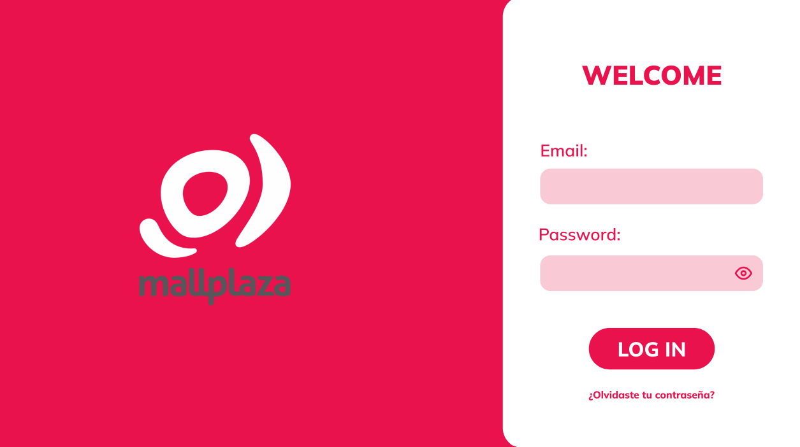

# 4. Especificación de Requerimientos y Prototipo

## 4.1. Módulos y Códigos de Requerimientos
<table>
    <tbody>
        <tr>
            <td>#</td>
            <td>Módulo</td>
            <td>#</td>
            <td>Requerimiento</td>
            <td>Código</td>
        </tr>
        <tr>
            <td>1</td>
            <td><a href="4.1/4.1.md">Logueo y seguridad</td>
            <td>1</td>
            <td>Nombre del requerimiento</td>
            <td>R001</td>
        </tr>
        <tr>
            <td>2</td>
            <td><a href="4.2/4.2.md">Usuario</td>
            <td>2</td>
            <td>Nombre del requerimiento</td>
            <td>R002</td>
        </tr>
        <tr>
            <td>3</td>
            <td><a href="4.3/4.3.md">Arrendamiento</td>
            <td>3</td>
            <td>Nombre del requerimiento</td>
            <td>R003</td>
        </tr>
        <tr>
            <td rowspan="4">4</td>
            <td rowspan="4"><a href="4.4/4.4.md">Inquilino</td>
            <td>1</td>
            <td>Crear un nuevo Inquilino</td>
            <td>R001</td>
        </tr>
        <tr>
            <td>2</td>
            <td>Asignar un espacio a un inquilino</td>
            <td>R002</td>
        </tr>
        <tr>
            <td>3</td>
            <td>Eliminar o dar de baja a un inquilino</td>
            <td>R003</td>
        </tr>
        <tr>
            <td>4</td>
            <td>Gestionar la renovación de contratos</td>
            <td>R004</td>
        </tr>        
        <tr>
            <td>5</td>
            <td><a href="4.5/4.5.md">Facturación y Pagos</td>
            <td>5</td>
            <td>Nombre del requerimiento</td>
            <td>R005</td>
        </tr>
        <tr>
            <td>6</td>
            <td><a href="4.6/4.6.md">Recobro</td>
            <td>6</td>
            <td>Nombre del requerimiento</td>
            <td>R006</td>
        </tr>
        <tr>
            <td>7</td>
            <td><a href="4.7/4.7.md">Eventos</td>
            <td>7</td>
            <td>Nombre del requerimiento</td>
            <td>R007</td>
        </tr>
        <tr>
            <td>8</td>
            <td><a href="4.8/4.8.md">Mantenimiento y Servicio</td>
            <td>8</td>
            <td>Nombre del requerimiento</td>
            <td>R008</td>
        </tr>
    </tbody>
</table>

## Prototipo portada

## Enlace de Figma
LINK DEL FIGMA: [Grupo 5 Prototipo](https://www.figma.com/design/VWVEbq72V7HGyZJb9HV39f/DBD_Grupo_5?node-id=71-35&node-type=frame&t=RMNqg1MfI5jyNTJV-0)
