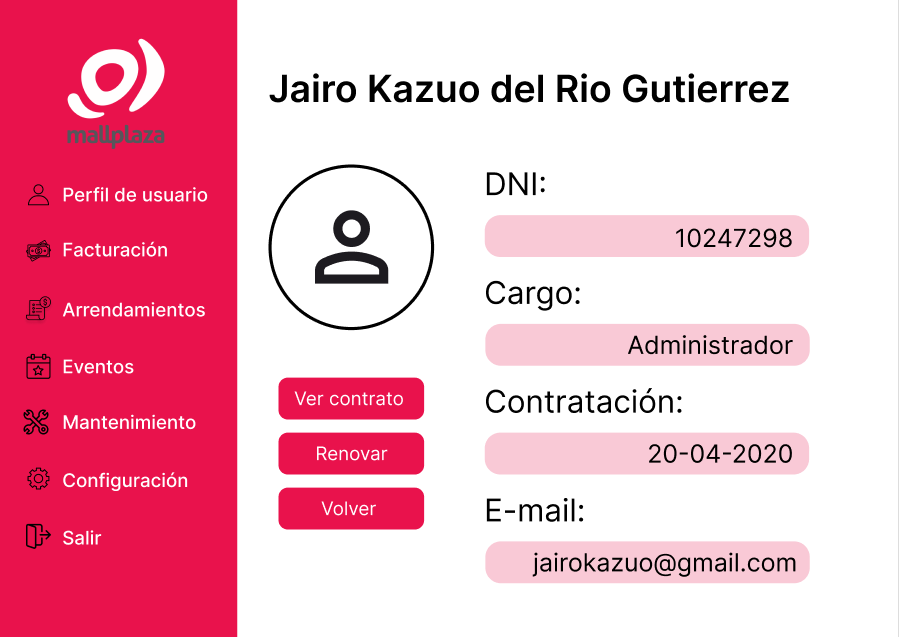
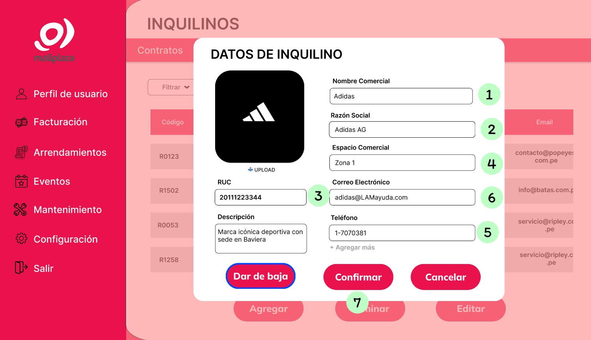
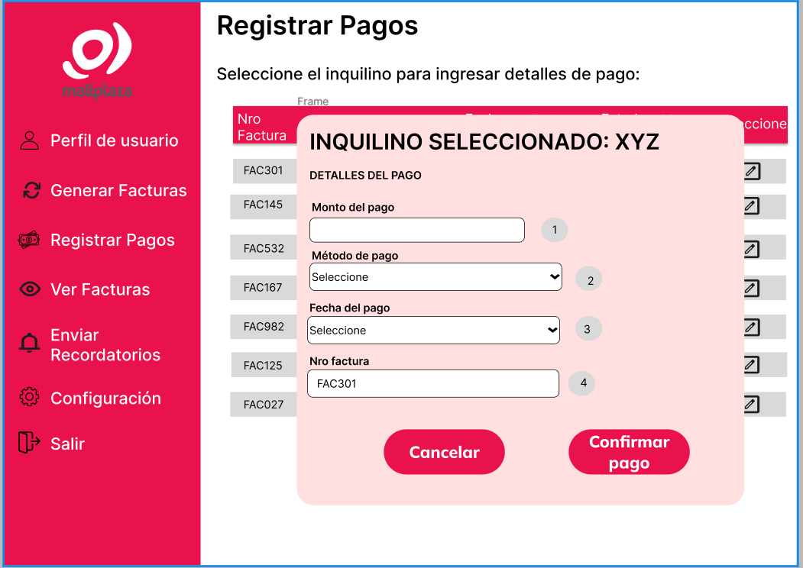

# 8.1. Sentencias SQL por módulo / prototipo

# 8.1. Sentencias SQL por módulo / prototipo

| Codigo Requerimiento  |R-05| 
|-----------------------|-------|
| Codigo Interfaz       |I-003, I-008| 
| Imagen interfaz       || 
| Imagen interfaz       ||

## Sentencias SQL
### Eventos:
* **Carga de la página de Empleados:** Se llenará la tabla de todos los empleados en MallPlaza
```sql

SELECT * FROM inquilinos_tabla
WHERE id_inquilino = <2> 

```

* **Boton Registrar:** Cuando se selecciona muestra los campos a llenar del nuevo empleado.
```sql
INSERT INTO Empleado (id_empleado, cargo, first_last_name, second_last_name, fecha_nacimiento, id_persona, id_contrato_empleado)
VALUES
(<E120>,
 <Administrador de mantenimiento>,
 <Gomez>,
 <Sanchez>,
 <1990-06-15>,
 <P175>,
 <C150>);

```


| Codigo Requerimiento  |R-06| 
|-----------------------|-------|
| Codigo Interfaz       |I-003| 
| Imagen interfaz       ||

## Sentencias SQL
### Eventos:
* **Carga de la página de Empleados:** Se llenará la tabla de todos los empleados en MallPlaza
```sql

SELECT * FROM inquilinos_tabla
WHERE id_inquilino = <2> 

```

* **Boton Vinculados:** Cuando se selecciona muestra los empleados con contrato vigente.

```sql
SELECT E.id_empleado, E.cargo, E.first_last_name, E.second_last_name, E.fecha_nacimiento
FROM Empleado E
JOIN Contrato_Empleado C ON E.id_contrato_empleado = C.id_contrato_empleado
WHERE C.estado_contrato = 'Activo';

```


| Codigo Requerimiento  |R-07| 
|-----------------------|-------|
| Codigo Interfaz       |I004, I-005, I-006| 
| Imagen interfaz       || 
| Imagen interfaz       || 
| Imagen interfaz       ||

## Sentencias SQL
### Eventos:
* **Carga de la página del Empleado:** Se mostrará en pantalla los datos del empleado seleccionado.
```sql

SELECT * FROM inquilinos_tabla
WHERE id_inquilino = <2> 

```
Donde <2> representa el id del empleado seleccionado

* **Boton Ver contrato:** Cuando se selecciona muestra los detalles del contrato.

```sql
SELECT E.last_name, E.second_last_name, E.cargo, C.fecha_inicio, C.fecha_fin, C.estado_contrato, C.jornada_laboral
FROM Contrato_empleado C
JOIN Empleado E ON E.id_contrato_empleado = C.id_contrato_empleado
WHERE C.estado_contrato = 'Activo';

```
Donde <1> representa el id del empleado a renovar

* **Boton Renovar:** Cuando se selecciona cargará los datos del empleado, solo permitirá modificar la fecha de finalización del contrato.

```sql
UPDATE Contrato_Empleado
SET fecha_fin = <AAAA-MM-DD>
WHERE id_contrato_empleado = <1>;

```
Donde <1> representa el id del empleado a renovar


| Codigo Requerimiento  |R-08| 
|-----------------------|-------|
| Codigo Interfaz       |I-010| 
| Imagen interfaz       ||

## Sentencias SQL
### Eventos:
* **Carga de la página de Empleados:** Se llenará la tabla de todos los empleados en MallPlaza
```sql

SELECT FROM Empleados; --Vista creada en la base de datos

```

* **Boton Desvinculados:** Cuando se selecciona muestra los empleados con contrato no vigente.

```sql
SELECT E.id_empleado, E.cargo, E.first_last_name, E.second_last_name, E.fecha_nacimiento
FROM Empleado E
JOIN Contrato_Empleado C ON E.id_contrato_empleado = C.id_contrato_empleado
WHERE C.estado_contrato IN ('Suspendido', 'Finalizado');


```

| Codigo Requerimiento  |R-09| 
|-----------------------|-------|
| Codigo Interfaz       |I-011| 
| Imagen interfaz       ||

## Sentencias SQL
### Eventos:
* **Carga de la página de Contratos:** Se llenará la tabla de todos los contratos en MallPlaza
```sql
SELECT
    ca.id_contrato AS "Nro Contrato",
    p.id_persona AS "Inquilino",
    ec.tipo_inmueble AS "Inmueble",
    ca.fecha_inicio AS "Fecha Inicio",
    ca.fecha_vencimiento AS "Fecha Fin",
    ca.estado AS "Estado",
    ca.monto AS "Monto Renta"
FROM
    Contrato_Alquiler ca
JOIN
    Espacio_Comercial ec ON ca.id_espacio_comercial = ec.id_espacio_comercial
JOIN
    Inquilino i ON ec.id_espacio_comercial = i.id_espacio_comercial
JOIN
    Persona p ON i.id_persona = p.id_persona
ORDER BY
    ca.id_contrato;

```

* **Filtrar por tipo de inmueble :** El usuario elegirá el filtro "Tipo de inmueble" dentro del cuadro de opciones para realizar la consulta y poder mostrar los contratos con el tipo de inmueble seleccionado.
```sql
SELECT
    ca.id_contrato AS "Nro Contrato",
    p.id_persona AS "Inquilino",
    ec.tipo_inmueble AS "Inmueble",
    ca.fecha_inicio AS "Fecha Inicio",
    ca.fecha_vencimiento AS "Fecha Fin",
    ca.estado AS "Estado",
    ca.monto AS "Monto Renta"
FROM
    Contrato_Alquiler ca
JOIN
    Espacio_Comercial ec ON ca.id_espacio_comercial = ec.id_espacio_comercial
JOIN
    Inquilino i ON ec.id_espacio_comercial = i.id_espacio_comercial
JOIN
    Persona p ON i.id_persona = p.id_persona
WHERE ec.tipo_inmueble = <1>;

```

*Donde el valor seleccionado en <1> es utilizado para realizar la búsqueda de los contratos que posean esas caracteristicas*

* **Filtrar por Contratos recientes :** El usuario elegirá el filtro "Contratos recientes" dentro del cuadro de opciones para realizar la consulta y poder mostrar los contratos que se hayan registrado recientemente.
```sql
SELECT
    ca.id_contrato AS "Nro Contrato",
    p.id_persona AS "Inquilino",
    ec.tipo_inmueble AS "Inmueble",
    ca.fecha_inicio AS "Fecha Inicio",
    ca.fecha_vencimiento AS "Fecha Fin",
    ca.estado AS "Estado",
    ca.monto AS "Monto Renta"
FROM
    Contrato_Alquiler ca
JOIN
    Espacio_Comercial ec ON ca.id_espacio_comercial = ec.id_espacio_comercial
JOIN
    Inquilino i ON ec.id_espacio_comercial = i.id_espacio_comercial
JOIN
    Persona p ON i.id_persona = p.id_persona
ORDER BY ca.fecha_inicio DESC;

```

* **Filtrar por Contratos proximos a vencer :** El usuario elegirá el filtro "Proximos a vencer" dentro del cuadro de opciones para realizar la consulta y poder mostrar los resultados.
```sql
SELECT
    ca.id_contrato AS "Nro Contrato",
    p.id_persona AS "Inquilino",
    ec.tipo_inmueble AS "Inmueble",
    ca.fecha_inicio AS "Fecha Inicio",
    ca.fecha_vencimiento AS "Fecha Fin",
    ca.estado AS "Estado",
    ca.monto AS "Monto Renta"
FROM
    Contrato_Alquiler ca
JOIN
    Espacio_Comercial ec ON ca.id_espacio_comercial = ec.id_espacio_comercial
JOIN
    Inquilino i ON ec.id_espacio_comercial = i.id_espacio_comercial
JOIN
    Persona p ON i.id_persona = p.id_persona
ORDER BY ca.fecha_vencimiento DESC;

```

* **Filtrar por estado :** El usuario elegirá el filtro "Estado" dentro del cuadro de opciones para realizar la consulta y poder mostrar los contratos con el tipo de estado seleccionado.
```sql
SELECT
    ca.id_contrato AS "Nro Contrato",
    p.id_persona AS "Inquilino",
    ec.tipo_inmueble AS "Inmueble",
    ca.fecha_inicio AS "Fecha Inicio",
    ca.fecha_vencimiento AS "Fecha Fin",
    ca.estado AS "Estado",
    ca.monto AS "Monto Renta"
FROM
    Contrato_Alquiler ca
JOIN
    Espacio_Comercial ec ON ca.id_espacio_comercial = ec.id_espacio_comercial
JOIN
    Inquilino i ON ec.id_espacio_comercial = i.id_espacio_comercial
JOIN
    Persona p ON i.id_persona = p.id_persona
WHERE ca.estado = <4>;


```

*Donde el valor seleccionado en <4> es utilizado para realizar la búsqueda de los contratos con el respectivo tipo de estado*

| Codigo Requerimiento  |R-10| 
|-----------------------|-------|
| Codigo Interfaz       |I-012| 
| Imagen interfaz       ||

## Sentencias SQL
### Eventos:
* **Carga de los espacios comerciales/objetos de alquiler:** Se llenará la tabla de todos los espacios comerciales dentro de MallPlaza
```sql
SELECT 
    Espacio_Comercial.id_espacio_comercial AS "Código",
    Zonas.referencia AS "Referencia",
    Zonas.nombre_zona AS "Zona",
    Espacio_Comercial.tipo_inmueble AS "Tipo de Inmueble",
    Espacio_Comercial.tarifa AS "Tarifa",
    Espacio_Comercial.area AS "Área total",
    Espacio_Comercial.estado AS "Estado"
FROM 
    Espacio_Comercial
JOIN 
    Zonas ON Espacio_Comercial.nombre_zona = Zonas.nombre_zona;

```

* **Filtrar por tipo de inmueble :** El usuario elegirá el filtro "Tipo de inmueble" dentro del cuadro de opciones para realizar la consulta y poder mostrar los espacios comerciales con el tipo de inmueble seleccionado.
```sql
SELECT 
    Espacio_Comercial.id_espacio_comercial AS "Código",
    Zonas.referencia AS "Referencia",
    Zonas.nombre_zona AS "Zona",
    Espacio_Comercial.tipo_inmueble AS "Tipo de Inmueble",
    Espacio_Comercial.tarifa AS "Tarifa",
    Espacio_Comercial.area AS "Área total",
    Espacio_Comercial.estado AS "Estado"
FROM 
    Espacio_Comercial
JOIN 
    Zonas ON Espacio_Comercial.nombre_zona = Zonas.nombre_zona
WHERE
    Espacio_Comercial.tipo_inmueble = <1>;
    
```

*Donde el valor seleccionado en <1> es utilizado para realizar la búsqueda de los espacios comerciales que posean esas caracteristicas*

* **Filtrar por Mayor tarifa :** El usuario elegirá el filtro "Mayor tarifa" dentro del cuadro de opciones para realizar la consulta y poder mostrar los contratos con mayor tarifa.
```sql
SELECT 
    Espacio_Comercial.id_espacio_comercial AS "Código",
    Zonas.referencia AS "Referencia",
    Zonas.nombre_zona AS "Zona",
    Espacio_Comercial.tipo_inmueble AS "Tipo de Inmueble",
    Espacio_Comercial.tarifa AS "Tarifa",
    Espacio_Comercial.area AS "Área total",
    Espacio_Comercial.estado AS "Estado"
FROM 
    Espacio_Comercial
JOIN 
    Zonas ON Espacio_Comercial.nombre_zona = Zonas.nombre_zona
ORDER BY 
    Espacio_Comercial.tarifa DESC;

```

* **Filtrar por Menor tarifa :** El usuario elegirá el filtro "Menor tarifa" dentro del cuadro de opciones para realizar la consulta y poder mostrar los resultados.
```sql
SELECT 
    Espacio_Comercial.id_espacio_comercial AS "Código",
    Zonas.referencia AS "Referencia",
    Zonas.nombre_zona AS "Zona",
    Espacio_Comercial.tipo_inmueble AS "Tipo de Inmueble",
    Espacio_Comercial.tarifa AS "Tarifa",
    Espacio_Comercial.area AS "Área total",
    Espacio_Comercial.estado AS "Estado"
FROM 
    Espacio_Comercial
JOIN 
    Zonas ON Espacio_Comercial.nombre_zona = Zonas.nombre_zona
ORDER BY 
    Espacio_Comercial.tarifa ASC;

```

* **Filtrar por estado :** El usuario elegirá el filtro "Estado" dentro del cuadro de opciones para realizar la consulta y poder mostrar los contratos con el tipo de estado seleccionado.
```sql
SELECT 
    Espacio_Comercial.id_espacio_comercial AS "Código",
    Zonas.referencia AS "Referencia",
    Zonas.nombre_zona AS "Zona",
    Espacio_Comercial.tipo_inmueble AS "Tipo de Inmueble",
    Espacio_Comercial.tarifa AS "Tarifa",
    Espacio_Comercial.area AS "Área total",
    Espacio_Comercial.estado AS "Estado"
FROM 
    Espacio_Comercial
JOIN 
    Zonas ON Espacio_Comercial.nombre_zona = Zonas.nombre_zona
WHERE 
    Espacio_Comercial.estado = <4>;

```

*Donde el valor seleccionado en <4> es utilizado para realizar la búsqueda de los espacios comerciales con el respectivo tipo de estado*

| Codigo Requerimiento  |R-11| 
|-----------------------|-------|
| Codigo Interfaz       |I-011, I-013, I-014|
| Imagen interfaz       || 
| Imagen interfaz       ||
| Imagen interfaz       ||


## Sentencias SQL
### Eventos:
* **Carga de la pagina inicial:** Se llenará la tabla de todos los contratos dentro de MallPlaza
```sql
SELECT
    ca.id_contrato AS "Nro Contrato",
    p.nombre AS "Inquilino",
    ec.tipo_inmueble AS "Inmueble",
    ca.fecha_inicio AS "Fecha Inicio",
    ca.fecha_vencimiento AS "Fecha Fin",
    ca.estado AS "Estado",
    ca.monto AS "Monto Renta"
FROM
    Contrato_Alquiler ca
JOIN
    Espacio_Comercial ec ON ca.id_espacio_comercial = ec.id_espacio_comercial
JOIN
    Inquilino i ON ec.id_espacio_comercial = i.id_espacio_comercial
JOIN
    Persona p ON i.id_persona = p.id_persona
ORDER BY
    ca.id_contrato;

```

* **Seleccion de contrato :** El usuario elegirá cualquier contrato para poder visualizar todos sus detalles.
```sql
SELECT * FROM Contrato_Alquiler
WHERE id_contrato = <1>;
    
```

*Donde <1> representa el id del contrato de alquiler de un inquilino*

* **Editar contrato :** El usuario tendrá la opcion de editar el contrato seleccionado.
```sql
UPDATE Contrato_Alquiler
SET fecha_inicio = <8> 
    fecha_vencimiento = <9>
    estado = <5>
    porcentaje = <6>
    zona = <2>
    tipo_inmueble = <4>
WHERE id_inquilino = 'I001'; -- ejemplo

```


| Codigo Requerimiento  |R-012| 
|-----------------------|-------|
| Codigo Interfaz       |I-019| 
| Imagen interfaz       ||

## Sentencias SQL
### Eventos:
* **Carga de la página de Inquilinos:** Se llenará la tabla de los inquilinos vigentes en MallPlaza
```sql
SELECT i.id_inquilino,
		p.nombre as "Nombre",
		i.razon_social as "Razón Social",
		p.nro_documento as "RUC",
		c.nombre_zona as "Espacio Comercial",
		t.telefono as "Teléfono",
		e.email as "Email",
		i.estado_inquilino as "Estado Inquilino"
FROM inquilino i
JOIN persona p
	ON i.id_persona = p.id_persona
JOIN persona_email e
	ON p.id_persona = e.id_persona
JOIN persona_telefono t
	ON p.id_persona = t.id_persona
JOIN espacio_comercial c
	ON i.id_espacio_comercial = c.id_espacio_comercial;
```

* **Búsqueda de Inquilino:** El usuario ingresará el texto en la barra de búsqueda para realizar la consulta correspondiente según el atributo que haya seleccionado en el filtro.
```sql
SELECT i.id_inquilino,
		p.nombre as "Nombre",
		i.razon_social as "Razón Social",
		p.nro_documento as "RUC",
		c.nombre_zona as "Espacio Comercial",
		t.telefono as "Teléfono",
		e.email as "Email",
		i.estado_inquilino as "Estado Inquilino"
FROM inquilino i
JOIN persona p
	ON i.id_persona = p.id_persona
JOIN persona_email e
	ON p.id_persona = e.id_persona
JOIN persona_telefono t
	ON p.id_persona = t.id_persona
JOIN espacio_comercial c
	ON i.id_espacio_comercial = c.id_espacio_comercial
WHERE 	id_inquilino = <1> OR
		p.nombre = <1> OR
		i.razon_social = <1> OR
		p.nro_documento = <1>;
```

*Donde el valor ingresado en <1> se captura y se realiza la búsqueda según la opción que se seleccionó en <2>*

| Codigo Requerimiento  |R-013| 
|-----------------------|-------|
| Codigo Interfaz       |I-021, I-022| 
| Imagen interfaz       ||
| Imagen interfaz       ||

## Sentencias SQL
### Eventos:
* **Carga de página:** Se llenará la tabla de los inquilinos vigentes en MallPlaza.
```sql
SELECT * FROM inquilinos_tabla; --Vista creada en la base de datos
```
* **Boton Editar:** Cuando el usuario seleccione el inquilino que quiera editar y presione el botón "Editar" se abrirá una ventana emergente con los datos de ese inquilino.
```sql
SELECT * FROM inquilinos_tabla
WHERE id_inquilino = <2>
```
*Donde <2> representa el id del inquilino seleccionado para realizar la búsqueda del inquilino a editar*
* **Editar Datos de Inquilino:** El usuario selecciona los datos principales del inquilino que quiera modificar, luego el usuario podrá dar al botón "Aceptar".
```sql
UPDATE inquilinos_tabla
SET nombre = <1>,
    razon_social = <2>,
    ruc = <3>,
    espacio_comercial = <4>,
    telefono = <5>,
    email = <6>,
    estado_inquilino = <7>
WHERE id_inquilino = 'I001'; --ejemplo
```
| Codigo Requerimiento  |R-013| 
|-----------------------|-------|
| Codigo Interfaz       |I-021, I-023| 
| Imagen interfaz       ||
| Imagen interfaz       ||

## Sentencias SQL
### Eventos:
* **Carga de Datos:** Se llenará la tabla de los inquilinos vigentes en MallPlaza.
```sql
SELECT * FROM inquilinos_tabla; --Vista creada en la base de datos
```
* **Boton Eliminar:** Cuando el usuario seleccione el inquilino que quiera eliminar y presione el botón "Eliminar" se abrirá una ventana emergente con los datos de ese inquilino.
```sql
SELECT * FROM inquilinos_tabla
WHERE id_inquilino = <2>
```
*Donde <2> representa el id del inquilino seleccionado para realizar la búsqueda del inquilino a editar*
* **Eliminar registro de Inquilino:** El usuario podrá ver la información del inquilino antes de confirmar y presionar el botón de "Eliminar"
```sql
DELETE FROM inquilinos
WHERE id_inquilino = <2>;
```
*Donde <2> representa el id del inquilino seleccionado para realizar la búsqueda del inquilino a editar*

| Codigo Requerimiento  |R-015| 
|-----------------------|-------|
| Codigo Interfaz       |I-025| 
| Imagen interfaz       ||

## Sentencias SQL
### Eventos:
* **Consulta para la generacion de facturas
```sql
INSERT INTO Factura (id_factura, estado_factura, fecha_emision, monto_total, fecha_vencimiento, id_inquilino)
SELECT
    'F' || LPAD(nextval('factura_seq')::text, 6, '0') AS "id_factura",
    'Pendiente' AS "estado_factura",
    ca.fecha_inicio AS "fecha_emision",
    ca.monto AS "monto_total",
    ca.fecha_vencimiento AS "fecha_vencimiento",
    i.id_inquilino AS "id_inquilino"
FROM
    Contrato_Alquiler ca
JOIN
    Espacio_Comercial ec ON ca.id_espacio_comercial = ec.id_espacio_comercial
JOIN
    Inquilino i ON ec.id_espacio_comercial = i.id_espacio_comercial
WHERE
    ca.estado = 'Activo';
```

* **Filtrar por estado del contrato :** El usuario elegirá el filtro "estado".
```sql
SELECT
    ca.id_contrato AS "Nro Contrato",
    p.id_persona AS "Inquilino",
    ec.tipo_inmueble AS "Inmueble",
    ca.fecha_inicio AS "Fecha Inicio",
    ca.fecha_vencimiento AS "Fecha Fin",
    ca.estado AS "Estado",
    ca.monto AS "Monto Renta"
FROM
    Contrato_Alquiler ca
JOIN
    Espacio_Comercial ec ON ca.id_espacio_comercial = ec.id_espacio_comercial
JOIN
    Inquilino i ON ec.id_espacio_comercial = i.id_espacio_comercial
JOIN
    Persona p ON i.id_persona = p.id_persona
WHERE ca.estado = <2>;

```

* **Filtrar contratos próximos a vencer :** El usuario elegirá el filtro "proximos a vencer".
```sql
SELECT
    ca.id_contrato AS "Nro Contrato",
    p.id_persona AS "Inquilino",
    ec.tipo_inmueble AS "Inmueble",
    ca.fecha_inicio AS "Fecha Inicio",
    ca.fecha_vencimiento AS "Fecha Fin",
    ca.estado AS "Estado",
    ca.monto AS "Monto Renta"
FROM
    Contrato_Alquiler ca
JOIN
    Espacio_Comercial ec ON ca.id_espacio_comercial = ec.id_espacio_comercial
JOIN
    Inquilino i ON ec.id_espacio_comercial = i.id_espacio_comercial
JOIN
    Persona p ON i.id_persona = p.id_persona
ORDER BY ca.fecha_vencimiento DESC;
```
| Codigo Requerimiento  |R-017| 
|-----------------------|-------|
| Codigo Interfaz       |I-028| 
| Imagen interfaz       ||

## Sentencias SQL
### Eventos:
* **Insertar datos para registrar pago
```sql
INSERT INTO pagos_tabla (nro_factura, monto_pago, metodo_pago, fecha_pago)
VALUES (<nro_factura>,     -- número de la factura seleccionada
        <monto_pago>,      -- monto del pago ingresado
        <metodo_pago>,     -- método de pago seleccionado (Ej. 'Efectivo', 'Tarjeta', 'Transferencia')
        <fecha_pago>);     -- fecha del pago (puede ser la fecha actual o la proporcionada por el usuario)

-- Actualizar estado de la factura (si es necesario)
UPDATE facturas_tabla
SET estado_factura = 'Pagada'  -- o 'Pendiente', según el estado
WHERE nro_factura = <nro_factura>;
```
| Codigo Requerimiento  |R-018| 
|-----------------------|-------|
| Codigo Interfaz       |I-029| 
| Imagen interfaz       ||

## Sentencias SQL
### Eventos:
* **Carga de la página de Recobros:**  Se llenará la tabla de todos los recobros.
```sql

SELECT * FROM Recobros

```

| Codigo Requerimiento  |R-019| 
|-----------------------|-------|
| Codigo Interfaz       |I-030| 
| Imagen interfaz       ||

## Sentencias SQL
### Eventos:
* **Boton Enviar:** Cuando se selecciona se registran los datos.
```sql

INSERT INTO Recobro (nombre_recobro, descripcion_recobro, id_recobro, Razon_recobro, Categoria_recobro, Estado_recobro)
VALUES
    (<Nuevo cartel>,
    <Nuevo cartel de presentación>,
    <R0123,
    <Cartel Deteriorado>,
    <Marketing>,
    <Enviado>);
```
*(El estado_recobro por defecto es Enviado y se actualiza según el proceso del recobro)

| Codigo Requerimiento  |R-20| 
|-----------------------|-------|
| Codigo Interfaz       |I-031| 
| Imagen interfaz       ||

## Sentencias SQL
### Eventos:
* **Boton Añadir actividad:** Se añade una actididad para la planificacion del proyecto
```sql
INSERT INTO actividades (cod_actividad, nombre_actividad, descripcion, Fecha_inicio_actividad, Fecha_fin_actividad, Costo_actividad, Estado_actividad, id_proyecto)
VALUES
    (<P001>,
    <Pintado>,
    <Pintado del cartel>,
    <2024-11-9>,
    <2024-11-10>,
    <80>,
    <En  espera>
    <id_proyecto>);

```
*(El Estado_actividad por defecto es En espera y se actualiza según se avance en el proyecto)

*(El id_proyecto es el id_proyecto del proyecto al cual se esta realizando la planificacion)

* **Boton Eliminar actividad:** Se elimina la actividad seleccionada
```sql
SELECT * FROM actividades
DELETE FROM actividades
WHERE cod_actividad = <codigo de actividad a eliminar>

```
Donde <cod_actividad> representa el codigo de la actividad seleccionado para la eliminación

* **Boton Finalizar planificacion:** Se crea el proyecto en la tabla Proyecto recobro
```sql

INSERT INTO Proyecto_recobro (Nombre_proyecto, id_proyecto, Costos, Fecha_inicio_proyecto, Fecha_inicio_proyecto, Estado_proyecto)
SELECT 'Nuevo cartel' AS Nombre_proyecto,
    'P0123'" AS id_proyecto,
    SUM(costo) AS Costos,
    MIN(fecha_inicio_actividad) AS fecha_inicio_proyecto,
    MAX(fecha_fin_actividad) AS fecha_fin_proyecto,
    'En espera' AS Estado_proyecto
FROM actividades
WHERE id_proyecto = [id del proyecto]
GROUP BY id_proyecto;
```

*(El Estado_proyecto por defecto es En espera y se actualiza según se avance en el proyecto)
*(El Fecha_inicio_proyecto por defecto es la Fecha_inicio_actividad de la primera actividad que se realiza)
*(El Fecha_inicio_proyecto por defecto es la Fecha_inicio_actividad de la primera actividad que se realiza)
*(El Costos del proyecto es la suma de los costos de todas las actividades que pertenecen al proyecto)

| Codigo Requerimiento  |R-021| 
|-----------------------|-------|
| Codigo Interfaz       |I-032, I-033| 
| Imagen interfaz       ||
| Imagen interfaz       ||

## Sentencias SQL
### Eventos:
* **Cargar la pagina del acuerdo especifico:**  Se cargan los datos  del acuerdo seleccionado
```sql

SELECT
    ar.fecha_acuerdo,
    ar.descripcion_acuerdo,
    ar.precio_acuerdo,
    pr.id_proyecto,
    pr.nombre_proyecto,
    pr.fecha_inicio_proyecto,
    pr.fecha_fin_proyecto,
    r.id_recobro,
    r.nombre_recobro,
    r.descripcion_recobro,
    r.razon_recobro,
    r.categoria_recobro,
    r.estado_recobro,
    p.nombre AS nombre_cliente,
    p.nro_documento,
    p.tipo_documento,
    i.razon_social AS razon_social_inquilino,
    pe.email AS email_cliente,
    pt.telefono AS telefono_cliente
FROM
    Acuerdo_recobro ar
JOIN
    Proyecto_recobro pr ON ar.id_proyecto = pr.id_proyecto
JOIN
    Recobro r ON pr.id_recobro = r.id_recobro
JOIN
    Persona p ON r.id_recobro = p.id_persona 
JOIN
    Inquilino i ON p.id_persona = i.id_persona
JOIN
    Espacio_Comercial e ON i.id_espacio_comercial = e.id_espacio_comercial
LEFT JOIN
    Persona_email pe ON p.id_persona = pe.id_persona 
LEFT JOIN
    Persona_telefono pt ON p.id_persona = pt.id_persona
WHERE
    ar.id_acuerdo = <ID del acuerdo>; 

```
* **Editar acuerdo** Se modifican los datos especificos de las tablas Acuerdo_recobro, Recobro y Proyecto_recobro simultaneamente
  
```sql
BEGIN TRANSACTION;

BEGIN TRY

    -- Actualización de Recobro
    UPDATE Recobro
    SET
        nombre_recobro = <nuevo_nombre_recobro>,
        categoria_recobro = <nueva_categoria_recobro>,
        descripcion_recobro = <nueva_descripcion_recobro>
    WHERE id_recobro = <id_recobro>;

    -- Actualización de Acuerdo_recobro
    UPDATE Acuerdo_recobro
    SET
        descripcion_acuerdo = <nueva_descripcion_acuerdo>,
        estado_acuerdo = <nuevo_estado_acuerdo>
    WHERE id_acuerdo = <id_acuerdo>
    AND id_recobro = <id_recobro>;

    -- Actualización de Proyecto_recobro
    UPDATE Proyecto_recobro
    SET
        nombre_proyecto = <nuevo_nombre_proyecto>,
        costos = <nuevos_costos>,
        fecha_inicio_proyecto = <nueva_fecha_inicio_proyecto>,
        fecha_fin_proyecto = <nueva_fecha_fin_proyecto>,
        estado_proyecto = <nuevo_estado_proyecto>
    WHERE id_proyecto = <id_proyecto>
    AND id_recobro = <id_recobro>;

    COMMIT;


```


| Codigo Requerimiento  |R-025| 
|-----------------------|-------|
| Codigo Interfaz       |I-039, I-040, I-045| 
| Imagen interfaz       ||
| Imagen interfaz       ||
| Imagen interfaz       ||

## Sentencias SQL
### Eventos I-039:
* **Carga de página:** Se llenará el apartado de incidencias con todas las incidencias registradas.
```sql
	select rdi.cod_incidencia, i.nombre_instalacion, rdi.descripcion, rdi.fecha_hora_registro, rdi.estado
	from registro_de_incidencia rdi, instalacion i
	where rdi.id_instalacion = i.id_instalacion;
    --limit 4 offset $1;
```
* **1 - 2 . Botón de Ordenar por: Estado Pendiente o Programado:** Permite filtrar los registros mediante su estado.
```sql
	select rdi.cod_incidencia, i.nombre_instalacion, rdi.descripcion, rdi.fecha_hora_registro, rdi.estado
	from registro_de_incidencia rdi
	inner join instalacion i on rdi.id_instalacion = i.id_instalacion 
	where (case when est = 'Pendiente' then rdi.estado = 'Pendiente'
				when est = 'Programado' then rdi.estado = 'Programado'
				else 1 = 0 
			end);
```
* **3. Botón de Ordenar por: Fecha más antigua:** Muestra las incidencias de la más antigua a la más reciente por la fecha registrada.
```sql
	select rdi.cod_incidencia, i.nombre_instalacion, rdi.descripcion, rdi.fecha_hora_registro, rdi.estado
	from registro_de_incidencia rdi, instalacion i
	where rdi.id_instalacion = i.id_instalacion
	order by rdi.fecha_hora_registro asc;
	--limit 4 offset $1;
```
### Eventos I-040, I045:
* **Carga de página:** Se llenará el apartado de instalaciones y el apartado de nombre de encargado.

```sql
	select id_instalacion , nombre_instalacion 
	from instalacion
	order by nombre_instalacion;

    select id_empleado , first_last_name, second_last_name 
	from empleado where cargo = 'Supervisor';
```
* **Botón de Aceptar:** Se registrará la programación de mantenimiento
```sql
	insert into program_mantenimiento (id_encargado, id_instalacion, prioridad,plazo, descripcion, cod_incidencia)
	values (<1>, <2>, <3>, <4>, <5>, cod_incidencia_asociado);

    update registro_de_incidencia 
	set estado = 'Programado' where cod_incidencia = cod_incidencia_asociado

```
| Codigo Requerimiento  |R-026| 
|-----------------------|-------|
| Codigo Interfaz       |I-041| 
| Imagen interfaz       ||
### Eventos:
* **Carga de página:** Se llenará el apartado de programaciones realizadas con los registros.
```sql
    select pm.dod_mantenimiento , i.nombre_instalacion , pm.descripcion , pm.plazo ,
	p.descrip_prioridad , pm.estado, e.first_last_name, e.second_last_name 
	from program_mantenimiento pm , instalacion i, prioridad p, empleado e 
	where pm.id_instalacion = i.id_instalacion
	and pm.prioridad = p.prioridad and pm.id_encargado = e.id_empleado;
	--limit 4 offset $1;
```
* **Cargar apartado de buscar encargado**
 ```sql
    select id_empleado , first_last_name, second_last_name 
	from empleado where cargo ='Supervisor';   
```   

* **1 - 2. Botón de Ordenar por: Estado Pendiente o Hecho:** Muestra las programaciones de mantenimiento que por su estado.
```sql
	select pm.dod_mantenimiento , i.nombre_instalacion , pm.descripcion , pm.plazo,
	p.descrip_prioridad , pm.estado, e.first_last_name, e.second_last_name 
	from program_mantenimiento pm
	inner join instalacion i on pm.id_instalacion = i.id_instalacion 
	inner join empleado e on pm.id_encargado = e.id_empleado 
	inner join prioridad p on pm.prioridad = p.prioridad 
	where
		(case when est = 'Pendiente' then pm.estado = 'Pendiente'
			when est = 'Hecho' then pm.estado = 'Hecho'
			else 1 = 0
		end
		);
```

* **3. Botón de Ordenar por: Plazo más reciente:** Muestra solo las programaciones de mantenimiento ordenado por el plazo del más reciente al más antiguo.
```sql
	select pm.dod_mantenimiento , i.nombre_instalacion , pm.descripcion , pm.plazo ,
	p.descrip_prioridad , pm.estado, e.first_last_name, e.second_last_name 
	from program_mantenimiento pm, instalacion i, empleado e, prioridad p 
	where pm.id_instalacion = i.id_instalacion
	and pm.prioridad = p.prioridad and pm.id_encargado = e.id_empleado
	order by pm.plazo desc ;
	--limit 4 offset $1;
```

* **4. Buscar por encargado:** Muestra solo las programaciones de mantenimiento de cierto encargado.
```sql
	select pm.dod_mantenimiento , i.nombre_instalacion , pm.descripcion , pm.plazo ,
	p.descrip_prioridad , pm.estado, e.first_last_name, e.second_last_name 
	from program_mantenimiento pm , instalacion i, prioridad p, empleado e 
	where pm.id_instalacion = i.id_instalacion
	and pm.prioridad = p.prioridad and pm.id_encargado = <4>;
	--limit 4 offset $1;
```
| Codigo Requerimiento  |R-027| 
|-----------------------|-------|
| Codigo Interfaz       |I-042, I-043, I-045| 
| Imagen interfaz       ||
| Imagen interfaz       ||
| Imagen interfaz       ||
### Eventos I-042:
* **Carga de página:** Se llenará el apartado de Registrar mantenimiento con todos los mantenimientos asignados a un encargado en específico.
```sql
	select pm.dod_mantenimiento , i.nombre_instalacion , pm.descripcion , pm.plazo ,
	p.descrip_prioridad , pm.estado, e.first_last_name, e.second_last_name 
	from program_mantenimiento pm , instalacion i, prioridad p, empleado e 
	where pm.id_instalacion = i.id_instalacion
	and pm.prioridad = p.prioridad and pm.id_encargado = 'id_empleado_logueado';
	--limit 4 offset $1;
```

* **1-2. Botón de Ordenar por: Estado Pendiente o Hecho:** Muestra solo las programaciones de mantenimiento por su estado
```sql
	select pm.dod_mantenimiento , i.nombre_instalacion , pm.descripcion , pm.plazo ,
	p.descrip_prioridad , pm.estado, e.first_last_name, e.second_last_name 
	from program_mantenimiento pm
	inner join instalacion i on pm.id_instalacion = i.id_instalacion 
	inner join empleado e on pm.id_encargado = e.id_empleado 
	inner join prioridad p on pm.prioridad = p.prioridad 
	where
		( case when estad = 'Pendiente' then pm.estado = 'Pendiente'
			   when estad = 'Hecho' then pm.estado = 'Hecho' 
			   else 1 = 0
			   
		end);
```

* **3. Botón de Ordenar por: Plazo más reciente:** Muestra solo las programaciones de mantenimiento ordenado por el plazo del más reciente al más antiguo con respecto a un encargado.
```sql
	select pm.dod_mantenimiento , i.nombre_instalacion , pm.descripcion , pm.plazo ,
	p.descrip_prioridad , pm.estado, e.first_last_name, e.second_last_name 
	from program_mantenimiento pm, instalacion i, empleado e, prioridad p 
	where pm.id_instalacion = i.id_instalacion
	and pm.prioridad = p.prioridad and pm.id_encargado = 'id_empleado_logueado'
	order by pm.plazo desc ;
```

* **4. Buscar por instalación:** Muestra solo las programaciones de mantenimiento con respecto a una instalación.

```sql
	select id_instalacion , nombre_instalacion 
	from instalacion
	order by nombre_instalacion;
```
```sql
    select pm.dod_mantenimiento , i.nombre_instalacion , pm.descripcion , pm.plazo ,
	p.descrip_prioridad , pm.estado, e.first_last_name, e.second_last_name 
	from program_mantenimiento pm , instalacion i, prioridad p, empleado e 
	where pm.id_instalacion = <4>
	and pm.prioridad = p.prioridad and pm.id_encargado = 'id_empleado_logueado' ;
```
### Eventos I-043, I-045:
* **Botón de Aceptar:** Se registrará el mantenimiento hecho.
```sql
	insert into registro_mantenimiento (dod_mantenimiento, id_instalacion, fecha_realizada, hora_inicio, hora_fin, observaciones)
	values ('cod_mant', 'id_inst', <1>, <2>, <3>, <4>);

	update program_mantenimiento 
	set estado = 'Hecho', where dod_mantenimiento = 'cod_mant';
```

| Codigo Requerimiento  |R-028| 
|-----------------------|-------|
| Codigo Interfaz       |I-038, I-045| 
| Imagen interfaz       ||
| Imagen interfaz       ||

## Sentencias SQL
### Eventos:
* **Carga de página:** Se llenará el apartado de instalaciones con todas las instalaciones registrados.
```sql
	select id_instalacion , nombre_instalacion 
	from instalacion
	order by nombre_instalacion;
```
* **Botón de Aceptar:** Se registrará la incidencia
```sql
	insert into registro_de_incidencia(
    id_empleado, id_instalacion, descripcion, fecha_hora_registro)
	values (<1>, <2>, <3>, 'fecha_hora_automática');
```
| Codigo Requerimiento  |R-29| 
|-----------------------|-------|
| Codigo Interfaz       |I-046| 
| Imagen interfaz       ||

## Sentencias SQL
### Eventos:
* **Carga de los datos de un Evento:** Se llenará la tabla de Eventos
* **Botón de Siguiente:** Se registrará la programación de mantenimiento
```sql
insert into Evento(
  nombre_evento, 
  descripcion, 
  categoria, 
  objetivo, 
  fecha_inicio, 
  fecha_fin,
  id_inquilino,
) VALUES (
  <1>,
  <2>,
  <3>,
  <4>,
  <5>,
  <6>,
  <7>,
);
```

| Codigo Requerimiento  |R-30| 
|-----------------------|-------|
| Codigo Interfaz       |I-046| 
| Imagen interfaz       ||
| Imagen interfaz       ||

## Sentencias SQL
### Eventos:
* **Filtro de datos de Zona común:** Se mandará una lista con las conincidencias de id_espacio_comun y se mostrarán en una lista para seleccionar.
```sql
SELECT DISTINCT e.id_espacio_comun
FROM Espacio_comun e
LEFT JOIN Fecha f ON e.id_espacio_comun = f.id_espacio_comun
WHERE (
    f.fecha_inicio IS NULL OR 
    f.fecha_fin < '2024-01-01' OR 
    f.fecha_inicio > '2024-01-10'
) 
AND e.id_espacio_comun LIKE '%<cadena>%';
```
