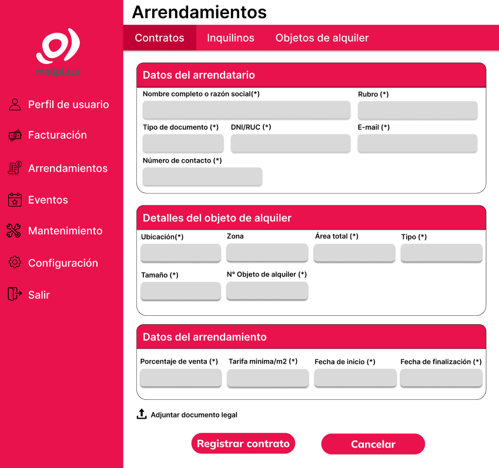
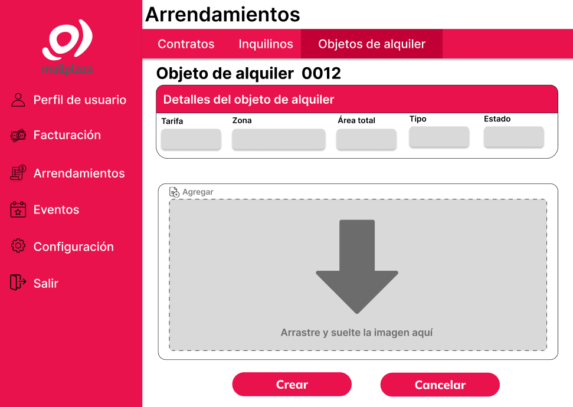
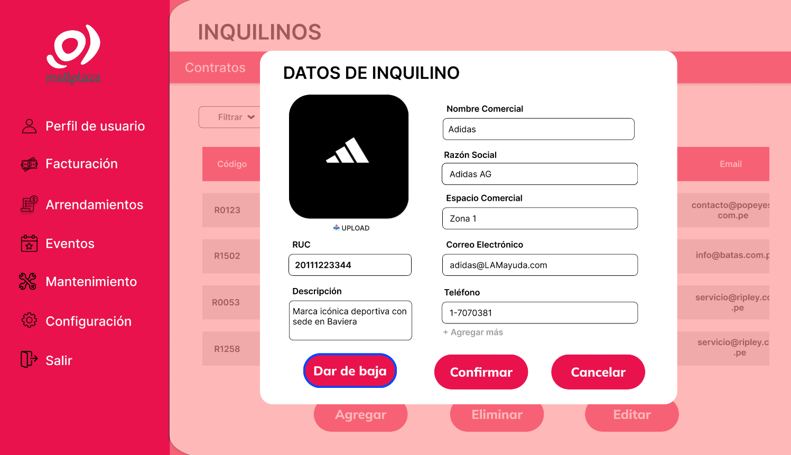

# 8.2. Alcance del Piloto (Funcionalidad primaria por módulo)
## MÓDULO 3: ARRENDAMIENTOS
* **Función Primaria:** 
* **Sustentación:** 

|Actividad| Descripcion       | 
|---------|-------------------|
| 1       | Luego ingresar a la sección de "Arrendamientos" y darle click a la sección de "Contratos" se mostrará la pantalla I-011 donde se podrá visualizar la tabla de los contratos los cuales estan registrados en MallPlaza   | 
| 2       | texto   | 
| 3       | texto   |
| 4       | texto   | 
| 5       | texto   |
| 6       | texto   |
| 7       | texto   |
| 8       | texto   |

## MÓDULO 4: INQUILINOS
* **Función Primaria:** 
* **Sustentación:** 

|Actividad| Descripcion       | 
|---------|-------------------|
| 1       | Luego ingresar a la sección de "Arrendamientos" y darle click a la sección de "Inquilinos" se mostrará la pantalla I-019 donde se podrá visualizar la tabla de los inquilinos los cuales tienen un registro en MallPlaza   | 
| 2       | texto   | 
| 3       | texto   |
| 4       | texto   | 
| 5       | texto   |
| 6       | texto   |
