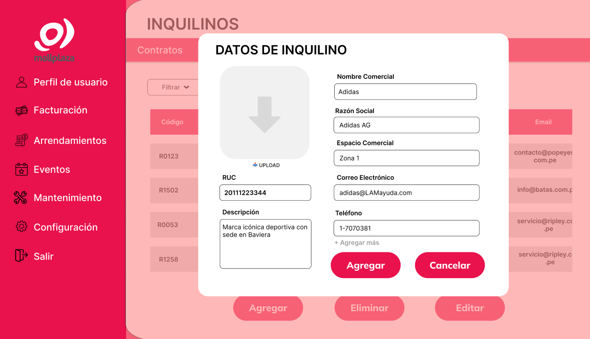

# 8.2. Alcance del Piloto (Funcionalidad primaria por módulo)
## MÓDULO 3: ARRENDAMIENTOS
* **Función Primaria: Gestionar y optimizar todo el proceso de arrendamiento de los locales comerciales, incluyendo contratos, pagos y seguimiento de incidencias, para garantizar un control eficiente de los ingresos y la ocupación en MallPlaza.** 
* **Sustentación: La gestión centralizada de los arrendamientos facilita la creación, seguimiento y renovación de contratos, y asegura un control preciso de los pagos y vencimientos. Esto reduce errores administrativos y mejora la eficiencia operativa, asegurando un flujo de ingresos constante y transparente.** 

|Actividad| Descripcion       | 
|---------|-------------------|
| 1       | Luego ingresar a la sección de "Arrendamientos" y darle click a la sección de "Contratos" se mostrará la pantalla I-011 donde se podrá visualizar la tabla de los contratos los cuales estan registrados en MallPlaza   | 
| 2       | Al pasar sobre cualquier contrato dentro de la tabla se podrá seleccionar para poder el contrato en mayor detalle   | 
| 3       | El usuario tendrá la opcion de poder editar algunos puntos del registro del contrato   |
| 4       | El usuario tendra la opcion de visualizar los espacios comerciales dentro de MallPlaza, para ellos tendra que dirigirse a la sección "Objetos de alquiler" que esta dentro del modulo de "Arrendamientos"  | 
| 5       | Al pasar por cualquier espacio comercial el usuario podrá seleccionarlo y ver mas detalles del objeto de alquiler   |
| 6       | De igual forma que los contratos, el usuario podrá editar detalles del espacio comercial   |

## MÓDULO 4: INQUILINOS
* **Función Primaria:** Centralizar y gestionar de manera eficiente toda la información relevante de los inquilinos para optimizar el control y seguimiento de los arrendamientos en MallPlaza.
* **Sustentación:** La centralización de la información de los inquilinos permite un control eficiente de los arrendamientos en MallPlaza. Además, reduce errores administrativos al mantener datos actualizados y accesibles, agilizando tareas de edición, búsqueda y filtrado.

|Actividad| Descripcion       | 
|---------|-------------------|
| 1       | Luego ingresar a la sección de "Arrendamientos" y darle click a la sección de "Inquilinos" se mostrará la pantalla I-019 donde se podrá visualizar la tabla de los inquilinos los cuales tienen un registro en MallPlaza   | 
| 2       | Si el usuario presiona el botón "Agregar" tendrá la opción de poder ingresar los datos de un nuevo inquilino que quiere registrar, se le mostrará la pantalla dei nterfaz I-020.   | 
| 3       | En la pantalla I-021 se muestra el registro del inquilino agregado correctamente   |
| 4       | El usuario tendrá la oportunidad de Editar cualquier registro de un usuario luego de seleccionar al inquilino y presionar el botón "Eliminar", se le mostrará la ventana emergente I-023  |
| 5       | |

## MÓDULO 6: RECOBROS
* **Función Primaria: Gestionar y optimizar todo el proceso de recobros de servicios, para garantizar una satisfaccion completa de los inquilinos en MallPlaza.** 
* **Sustentación: La gestión centralizada de los recobros facilita el proceso por el cual se realiza el recobro tanto por la solicitud, la planificacion, la negocioacion, registro de acuerdo y ase4gura un seguimiento sencillo y rapido seguimiento al proyecto del recobro. De esta forma tambien se mejora el uso del tiempo y el acceso a los archivos correspondientes.** 

|Actividad| Descripcion       | 
|---------|-------------------|
| 1       | Luego ingresar a la sección de "Recobros" y darle click a la sección de "Visualizar recobros" se mostrará la pantalla I-029 donde se podrá visualizar la tabla de los Recobros correspondientes al inquilino los cuales estan registrados en MallPlaza    | 
| 2       | Al presionar sobre el boton de  "Nuevo recobro" el inquilino se dirigira a la pantalla I-030 donde se le mostrara un formulario para la solicitud del nuevo recobro, al finalizar de rellenar el formulario tendra que presionar el boton de "Enviar" para que se registre la solicitud en el sistema  y el inquilino se dirigirá a a la pantalla I-029   | 
| 3       | En la pantalla I-031, el administrador planificara el proyecto para realizar el servicio de recobro usando un flujo de actividades conectando las actividades con unas flechas  que señalan la secuencia de estas actividades, al presionar "Eliminar proyecto" se cancela la planificacion, al presionar "Agregar actividad" se añade un nuevo cuadro de actividad, al presionar "Eliminar actividad" se eliminar la actividad seleccionada y las flechas de flujo  relacionadas a dicha actividad, al presionar "Finalizar planificacion" se registra la plan del proyecto en el sistema  |
| 4       | En la pantalla I-029 cuando el usuario presione el boton de "Detalles" se dirigira hacia la pantalla I-032 donde se le mostraran los detalles del acuerdo. En el caso de ser un administrador se le mostrara un boton de "Editar acuerdo", en el caso de ser un inquilino no se le mostrará este boton. Para ambos usuarios se les mostrara el botorn de regresar que los dirigira a la pantalla I-29  | 
| 5       | Cuando el administrador presione el boton de "Editar acuerdo" se le dirigira a la pantalla I-033 donde podra modificar algunos datos del acuerdo. Al presionar el boton de "Guardar cambios se le regresará a la pantalla I-032 con los datos modificados, al presionar el boton cancelar se le regresará a la pantalla I-032 sin los datos modificados"   |

## MÓDULO 7: EVENTOS
|Actividad| Descripcion       | 
|---------|-------------------|
| 1       | Luego ingresar a la sección de "Eventos" y darle click a la sección de "Crear Evento" se mostrará la siguiente pantalla     | 
| 2       | En ella se realizará el registro del evento llenando cada campo con su respectivo valor | 
| 3       | Después de llenar las fechas de inicio y final se podrá realizar la búsqueda de las zonas comunes disponibles en el intervalo de fechas seleccionadas | 

## MÓDULO 8: GESTION DE MANTENIMIENTOS PROGRAMADOS

* **Función Primaria:** La función primaria se centrará en programar los mantenimientos correctivos que va a ir desde el registro de una incidencia hasta el registro de la programación de mantenimiento con relación a esa incidencia.

* **Sustentación:** Esto es muy importante porque practicamente permite gestionar de una mejor manera el proceso para realizar mantenimiento correctivo.

|Actividad| Descripcion       | 
|---------|-------------------|
| 1       |En este apartado se registrará cierta incidencia para luego realizar su correspondiente programación de mantenimiento   | 
| 2       | Se hará click en la opción 'Aceptar' si se desea que se registre la incidencia   | 
| 3       | En este apartado se visualizará todas las incidencia que han sido registradas y a partir de esas incidencias se realizará el respectivo programación de mantenimiento  |
| 4       | En esta pantalla se realizará la entrada de datos correspondiente para realizar la programación de mantenimiento y se presiona el botón de confirmar.  |
| 5       | Se mostrara una pantalla de seguridad y se da 'Aceptar' para registrar la programación de mantenimiento|

