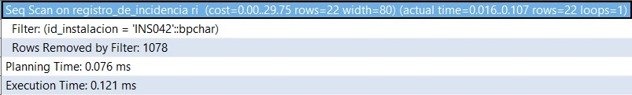

# 9.1. Índices
## MÓDULO 3: ARRENDAMIENTOS
```sql
--Tabla Espacio_comercial
CREATE INDEX idx_espacio_comercial_id ON Espacio_Comercial (id_espacio_comercial);

--Tabla Contrato_Alquiler
CREATE INDEX idx_contrato_alquiler_condicion ON Contrato_Alquiler (condicion);
CREATE INDEX idx_contrato_alquiler_id_contrato ON Contrato_Alquiler (id_contrato);
CREATE INDEX idx_contrato_alquiler_id_factura ON Contrato_Alquiler (id_factura);
```

## MÓDULO 4: INQUILINOS
```sql
--Tabla Inquilino
CREATE INDEX idx_inquilino_id_persona ON inquilino (id_persona);
CREATE INDEX idx_inquilino_id_espacio_comercial ON inquilino (id_espacio_comercial);

--Tabla Persona
CREATE INDEX idx_persona_id_persona ON persona (id_persona);

--Tabla Espacio_comercial
CREATE INDEX idx_espacio_comercial_id_zona ON espacio_comercial (id_zona);

--Tabla Zona
CREATE INDEX idx_zona_id_zona ON zona (id_zona);
```
## MÓDULO 5: Facturacion
```sql
--Tabla Factura
CREATE INDEX idx_factura_id_factura ON Factura (id_factura);
CREATE INDEX idx_factura_estado_factura ON Factura (estado_factura);
CREATE INDEX idx_factura_fecha_emision ON Factura (fecha_emision);
CREATE INDEX idx_factura_fecha_vencimiento ON Factura (fecha_vencimiento);


--Tabla Contrato_Alquiler
CREATE INDEX idx_contrato_alquiler_condicion ON Contrato_Alquiler (condicion);
CREATE INDEX idx_contrato_alquiler_id_contrato ON Contrato_Alquiler (id_contrato);
CREATE INDEX idx_contrato_alquiler_id_factura ON Contrato_Alquiler (id_factura);
```
## MÓDULO 8: MANTEMIENTOS

Para consultar todas las incidencias registradas con respecto a una instalación.
* Proceso sin índice
```sql
explain ANALYZE
select * from registro_de_incidencia ri
where ri.id_instalacion = 'INS042';
```


* Proceso con índice
```sql
create index idx_incidencia_id_instalacion
on registro_de_incidencia(id_instalacion);

explain ANALYZE
select * from registro_de_incidencia ri
where ri.id_instalacion = 'INS042';
```


